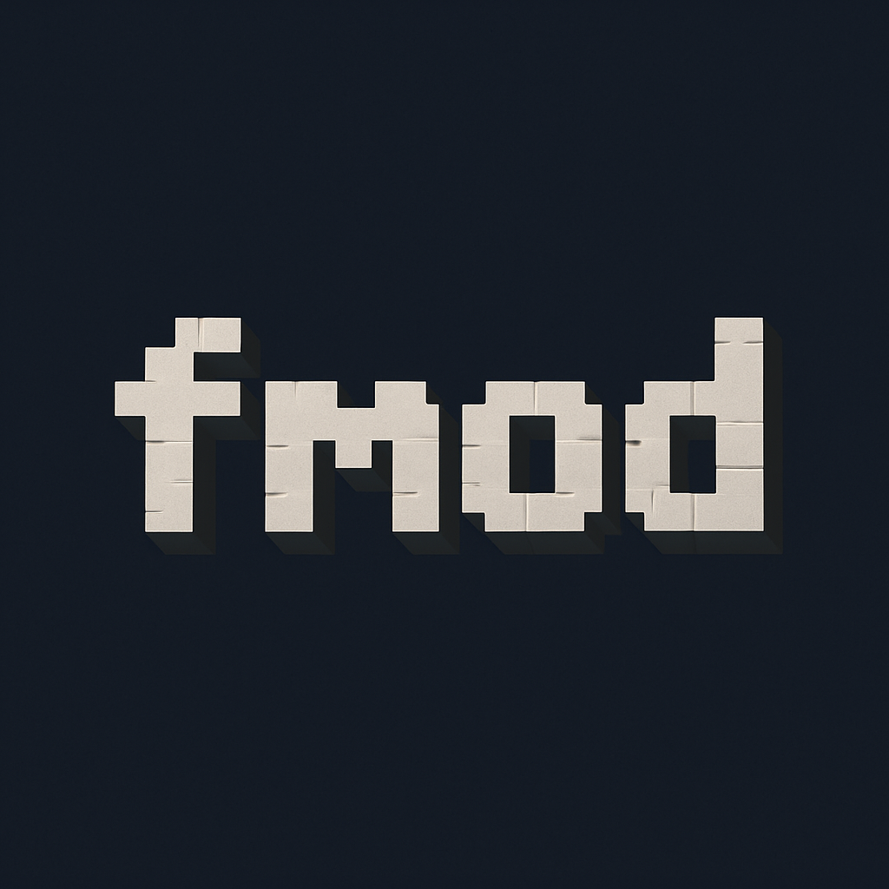

# FMod

<div align="center">
  
</div>

**FMod** is an addon for the [Meteor Client](https://meteorclient.com/), a modern Minecraft utility mod. FMod enhances your gameplay with a suite of powerful movement utilities, combat assistance, and other useful features, with some specifically tailored for servers like the LiveOverflow server.

<!-- Fancy badges -->
<div align="center">
  <a href="https://github.com/fluffysnaff/fmod/-/releases"></a>
  
  
  
</div>

---

## 🌟 Features

FMod introduces a variety of modules, commands, and HUD elements designed to give you an edge:

### ✨ Modules

*   **`InstaMine`**: Attempts to break blocks extremely quickly if they are already breakable in a very short amount of time (e.g., with Haste or efficient tools).
*   **`LiveWalk`**: Helps bypass certain anti-cheat measures (like those on the LiveOverflow server) by rounding your movement packet coordinates. Includes support for vehicles.
*   **`TpMine`**: Silently teleports you to a targeted block, breaks it, and then teleports you back to your original position.
*   **`InfReach`**: Targets the closest entity within your aim and a configurable range. It then teleports you to the target, attacks it, and returns you to your starting position. Includes on-screen target highlighting.
*   **`FrozenWalk`**: Allows you to move within protected regions or bypass certain movement restrictions without being teleported back by the server. Includes an anti-fly-kick feature.
*   **`NoTextureRotations`**: Disables the random rotation of certain block textures (e.g., grass, sand, bedrock), providing a more consistent and potentially cleaner visual experience. *Requires a world rejoin or graphics reload to take full effect.*
*   **`FrameDupe`**: A utility that automatically interacts with nearby item frames to duplicate items. It works by quickly placing and breaking items in frames, which can trigger duplication glitches on certain servers.

### ⌨️ Commands

Commands are prefixed with a `.` (dot), Meteor Client's default command prefix.

*   **`.teleport` (aliases: `.tp`)**
    *   Usage: `.tp <x> <y> <z> [ticks]`
    *   Teleports you short distances. The optional `ticks` argument specifies the number of movement packets sent, which can influence how the teleport is processed by the server.
*   **`.autoclip` (aliases: `.ac`, `.aclip`)**
    *   Usage: `.autoclip <direction>`
    *   Clips you through the ground either up (`1`) or down (`-1`) to the nearest air block.
*   **`.shclip` (aliases: `.hc`, `.shc`)**
    *   Usage: `.shclip <distance>`
    *   Clips you horizontally through walls in the direction you are looking.
*   **`.dclip` (aliases: `.dc`)**
    *   Usage: `.dclip <distance>`
    *   Clips you in your direct view direction (can be horizontal, vertical, or diagonal).
*   **`.clubmate` (aliases: `.cm`, `.clubm`, `.cmate`)**
    *   Usage: `.clubmate clubmate`
    *   A specialized command designed for the LiveOverflow server to interact with a specific chest and obtain a "Club-Mate."

### 🖥️ HUD

*   **`InfReach Target`**: Displays the name of the current entity being targeted by the `InfReach` module on your Heads-Up Display.

---

## 🚀 How to Use

1.  **Install Meteor Client**: If you haven't already, download and install [Meteor Client](https://meteorclient.com/download) for your Minecraft version (e.g., 1.21.5). Make sure you also have the Fabric Loader and Fabric API.
2.  **Download FMod**:
    *   It's only possible now to build it yourself from the source code(see below).
3.  **Install FMod**: Place the downloaded `fmod-[version].jar` file into your `.minecraft/mods/` folder. This folder should also contain your Meteor Client jar and Fabric API jar.
4.  **Launch Minecraft**: Start Minecraft using the Fabric loader profile from your Minecraft launcher. FMod will load automatically as an addon to Meteor Client.

---

## 🛠️ Building from Source (Optional)

If you wish to build FMod from its source code:

1.  **Clone the Repository**:
    ```bash
    git clone https://github.com/fluffysnaff/fmod.git
    cd fmod
    ```
2.  **Build the Project**:
    Use Gradle Wrapper to build the project.
    *   On Windows:
        ```bash
        gradlew build
        ```
    *   On macOS/Linux:
        ```bash
        ./gradlew build
        ```
3.  **Locate the Jar**: The compiled `.jar` file (e.g., `fmod-0.1.1.jar`) will be located in the `build/libs/` directory. You can then use this jar as described in the "How to Use" section.

---

## 🙏 Credits

This project wouldn't be possible without the work and inspiration from others:

*   **[Meteor Client Development Team](https://github.com/MeteorDevelopment/meteor-client/)**
*   **[rfresh2/NoTextureRotations](https://github.com/rfresh2/NoTextureRotations/)**
*   **[JorianWoltjer/LiveOverflowMod](https://github.com/JorianWoltjer/LiveOverflowMod)**

---

## Star History

[](https://www.star-history.com/#fluffysnaff/fmod&Date)
